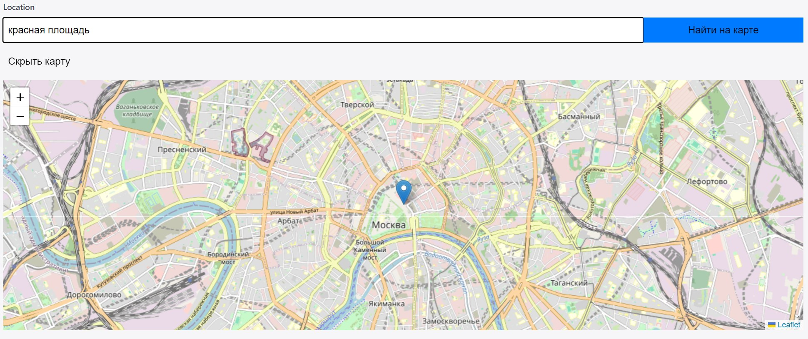

# OpenStreetMapField Component

OpenStreetMapField — это компонент на базе React и Leaflet, предназначенный для использования с TinaCMS для отображения, геолокации и редактирования местоположений на карте OpenStreetMap.

## Особенности

- Поддержка ввода адреса и конвертации его в географические координаты.
- Возможность перемещения на карте кликом и сохранения нового местоположения.
- Возможность скрытия и показа карты для оптимизации загрузки страницы.

## Требования

- React 17+
- Leaflet
- React-Leaflet
- TinaCMS

## Начало работы

### Установка

1. Скачайте компонент OpenStreetMapField.tsx в папку tina/
2. Установите зависмости
```
npm install react react-dom leaflet react-leaflet tinacms
```
3. Подключите компонент в config.ts
в самом верху
```javascript
import { defineConfig, wrapFieldsWithMeta } from 'tinacms';
import OpenStreetMapField from './OpenStreetMapField'; 

```
и включаем поле в коллекции 

```javascript
schema: {
collections: [
{
name: "location",
label: "Location",
path: "content",
fields: [
{
name: "location",
label: "Location",
type: "object",
ui: {
component: OpenStreetMapField,
},
fields: [
{ name: "lat", type: "number", label: "Latitude" },
{ name: "lng", type: "number", label: "Longitude" },
{ name: "address", type: "string", label: "Address" }
],
},
],
},
],

}

```

### Использование
При редактировании появится карта можно выбрать локацию в странице сохранится широта и долгота, а если вписать адрес то он тоже сохранится.
Моя первая попытка, что то сделать на js если сможете улучшить - буду только рад!


